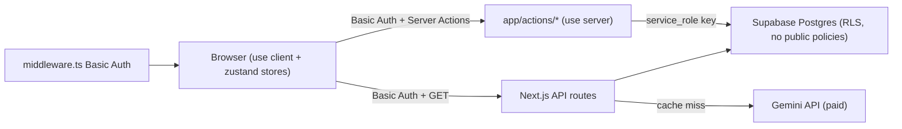

# Trackros Security Plan

> **Living document** — update this file whenever auth, RLS, API routes, env vars, or deployment config change.
>
> **Last reviewed:** 2026-07-05 (post-deploy security hardening + verification script)  
> **Stack:** React 19, TypeScript, Next.js 15, Bun, Tailwind 4, Supabase (Postgres), Vercel, Google Gemini  
> **App purpose:** Single-user nutrition tracker — food logging, macro/nutrient goals, meal presets, history/calendar. Sensitive data includes age, gender, daily food logs, and health-related goals.

---

## How to use this document

1. Work through the **Prioritized Checklist** (bottom) in order — P0 items block safe public deployment.
2. When you change security-related code, update the matching section and check off the item.
3. Re-run the review triggers listed in **Maintenance** at least quarterly or before each production release.

---

## Architecture & data flow

Trackros is a Next.js App Router app. Client components call **Server Actions** (not Supabase directly). The server uses a **service-role** key. The entire app is gated by **HTTP Basic Auth** at the edge. RLS is enabled with **no public policies** — the anon key cannot access data.



**Key files**

| Layer | Files |
|-------|-------|
| Edge gate | [`middleware.ts`](../middleware.ts), [`app/api/logout/route.ts`](../app/api/logout/route.ts) |
| Supabase server client | [`lib/supabase-server.ts`](../lib/supabase-server.ts) |
| DB queries (server-only) | [`lib/supabase-queries.ts`](../lib/supabase-queries.ts) |
| Server Actions | [`app/actions/dashboard.ts`](../app/actions/dashboard.ts), [`app/actions/history.ts`](../app/actions/history.ts), [`app/actions/settings.ts`](../app/actions/settings.ts) |
| Schema & RLS | [`supabase/schema.sql`](../supabase/schema.sql) |
| API routes | [`app/api/food/search/route.ts`](../app/api/food/search/route.ts), [`app/api/food/suggest/route.ts`](../app/api/food/suggest/route.ts) |
| Client state | [`store/useDashboardStore.ts`](../store/useDashboardStore.ts), [`store/useHistoryStore.ts`](../store/useHistoryStore.ts) |
| Env template | [`.env.example`](../.env.example) |

---

## 1. Authentication flows

**Current state:** Single-user HTTP Basic Auth gate via [`middleware.ts`](../middleware.ts). No bearer tokens or Supabase Auth sessions. Logout at [`app/api/logout/route.ts`](../app/api/logout/route.ts) returns 401 to drop cached Basic credentials. Password rotation (`APP_BASIC_AUTH_PASSWORD`) is the server-side revocation mechanism.

### Threat vectors

| Threat | Description | Severity |
|--------|-------------|----------|
| **Auth bypass** | Mitigated by Basic Auth gate; bypass only if credentials leak or gate is disabled in production. | Medium |
| **Session fixation / token theft** | N/A — no session tokens; only Basic Auth credentials cached by browser. | Low |
| **Privilege escalation** | N/A — single-user, no roles. | N/A |
| **Account enumeration** | N/A today; relevant when sign-up/login is added. | Future |

### Mitigations

| Action | Files to change |
|--------|-----------------|
| ~~Option B — Single-user private app~~ | **Implemented:** HTTP Basic Auth in [`middleware.ts`](../middleware.ts); service-role server access; RLS locked down. | Done |
| Consider Vercel Deployment Protection as production-grade supplement to Basic Auth. | Vercel Dashboard |
| Multi-user path (future): Supabase Auth + per-user RLS if app scope expands. | [`supabase/schema.sql`](../supabase/schema.sql) |

### Compliance notes

- **OWASP A01:2021 — Broken Access Control**
- **GDPR:** Age and gender in `user_goals` are personal data. Once auth exists, tie data to a user and support export/deletion (Art. 15, 17).

---

## 2. Data storage & API access (Supabase)

**Current state:** RLS enabled on all tables with **no public policies** — `anon` and `authenticated` roles are denied. Server uses `SUPABASE_SERVICE_ROLE_KEY` via [`lib/supabase-server.ts`](../lib/supabase-server.ts) (bypasses RLS). Browser no longer holds any Supabase key.

### Threat vectors

| Threat | Description | Severity |
|--------|-------------|----------|
| **Broken access control** | Mitigated — anon key denied by RLS; DB access server-only. Re-apply [`schema.sql`](../supabase/schema.sql) RLS section on live DB. | Low (after migration) |
| **Data exfiltration via anon key** | Mitigated once RLS migration is applied and anon key rotated. | Low |
| **Data tampering / deletion** | Attacker modifies goals, deletes logs, poisons food nutrient cache. | High |
| **SQL injection** | Low — Supabase client uses parameterized PostgREST queries; no raw SQL in app code. | Low |
| **Mass assignment** | Mitigated — Zod validation at Server Action / API entry points; CHECK constraints in DB. | Done |

### Mitigations

| Action | Files to change |
|--------|-----------------|
| ~~Replace permissive RLS~~ | **Done** — all public policies dropped in [`supabase/schema.sql`](../supabase/schema.sql). | Done |
| ~~Server-side input validation (Zod)~~ | **Done** — [`lib/validation.ts`](../lib/validation.ts), [`app/actions/*`](../app/actions/dashboard.ts) | Done |
| ~~DB CHECK constraints for nutrient/serving bounds~~ | **Done** — [`supabase/schema.sql`](../supabase/schema.sql) | Done |
| Never expose `service_role` key to client. | [`lib/supabase-server.ts`](../lib/supabase-server.ts) — `import "server-only"` |
| Rotate/regenerate anon key (no longer used by app). | Supabase Dashboard → Settings → API |

### Relevant source (permissive RLS today)

```sql
-- supabase/schema.sql — RLS enabled, no public policies
alter table public.log_entries enable row level security;
-- (all legacy *_anon and *_authenticated policies dropped)
```

### Supabase integration review (2026-07-05)

**RLS:** All 6 tables have RLS enabled with no public policies. Server uses `service_role` (bypasses RLS). Re-apply [`schema.sql`](../supabase/schema.sql) on live DB if not yet done.

**Input validation:** Zod schemas in [`lib/validation.ts`](../lib/validation.ts) validate all mutating Server Actions and API route params before DB writes.

**Error handling:** [`lib/db-errors.ts`](../lib/db-errors.ts) `sanitizeDbError()` replaces raw Postgres messages in [`lib/supabase-queries.ts`](../lib/supabase-queries.ts).

**DB constraints:** CHECK constraints on foods, log_entries, meal_preset_items, user_goals (non-negative nutrients, positive servings, age 1–120).

**Regression tests:** [`test/validation.test.ts`](../test/validation.test.ts) — run with `npm test`.

### Compliance notes

- **OWASP A01 — Broken Access Control**
- **Supabase best practice:** RLS policies must reference `auth.uid()` for user-owned rows.

---

## 3. Frontend-to-backend communication

**Current state:** Client stores call Server Actions in [`app/actions/`](../app/actions/dashboard.ts). DB queries in [`lib/supabase-queries.ts`](../lib/supabase-queries.ts) are server-only. API routes remain behind the Basic Auth gate but still lack rate limiting.

### Threat vectors

| Threat | Description | Severity |
|--------|-------------|----------|
| **Unauthenticated API abuse** | Partially mitigated — API routes behind Basic Auth gate; rate limiting still needed. | Medium |
| **Debug telemetry leakage** | **Fixed** — agent log blocks removed. | Done |
| **IDOR** | Log entry IDs are sequential integers; any caller can delete/update any entry. | High |

### Mitigations

| Action | Files to change |
|--------|-----------------|
| ~~Remove debug telemetry~~ | **Done** | Done |
| ~~Move mutations to Server Actions~~ | **Done** — [`app/actions/`](../app/actions/dashboard.ts), stores updated | Done |
| ~~CSRF protection~~ | **Done** — Server Action `allowedOrigins` in [`next.config.ts`](../next.config.ts); same-origin guard in [`lib/csrf.ts`](../lib/csrf.ts) for API routes | Done |
| ~~Harden ThemeScript inline script interpolation~~ | **Done** — [`components/theme/ThemeScript.tsx`](../components/theme/ThemeScript.tsx) uses `JSON.stringify` for storage key |
| Keep `dangerouslySetInnerHTML` limited to static scripts; add CSP hash for theme script. | [`components/theme/ThemeScript.tsx`](../components/theme/ThemeScript.tsx), [`next.config.ts`](../next.config.ts) |
| ~~Sanitize errors returned to client~~ | **Done** — [`lib/db-errors.ts`](../lib/db-errors.ts), [`lib/supabase-queries.ts`](../lib/supabase-queries.ts) | Done |
| ~~Cap and validate API query parameters (`q`, `id`)~~ | **Done** — [`lib/validation.ts`](../lib/validation.ts), food API routes | Done |

### XSS review (2026-07-04)

**Current state:** User-generated content (food names, meal names, error text) is rendered via JSX text interpolation (`{value}`), which React auto-escapes. No user HTML is rendered. One `dangerouslySetInnerHTML` usage exists in the theme bootstrap script; it is hardened with `JSON.stringify` for interpolated values.

**Secure patterns**

| Pattern | When to use |
|---------|-------------|
| JSX `{value}` | Default for all user-generated text |
| `escapeHtml()` in [`lib/sanitize.ts`](../lib/sanitize.ts) | Manual HTML/attribute string assembly only |
| DOMPurify (`isomorphic-dompurify` for SSR) | If untrusted HTML must be rendered via `dangerouslySetInnerHTML` |

**Regression tests:** [`test/xss.test.tsx`](../test/xss.test.tsx) — run with `npm test`.

### CSRF review (2026-07-05)

**Current state:** Auth uses ambient HTTP Basic Auth ([`middleware.ts`](../middleware.ts)) — browsers auto-attach credentials to all same-origin requests, creating a CSRF precondition. The app sets **no cookies**, so `SameSite` cookie guidance is N/A.

**Protections**

| Layer | Mechanism | Files |
|-------|-----------|-------|
| Server Actions | POST-only; Next.js validates `Origin == Host`; origins pinned via `experimental.serverActions.allowedOrigins` | [`next.config.ts`](../next.config.ts), [`app/actions/*`](../app/actions/dashboard.ts) |
| API routes (GET) | Same-origin guard via `Sec-Fetch-Site`, `Origin`, and `Referer` | [`lib/csrf.ts`](../lib/csrf.ts), [`app/api/food/search/route.ts`](../app/api/food/search/route.ts), [`app/api/food/suggest/route.ts`](../app/api/food/suggest/route.ts) |
| Logout (GET) | Intentionally navigation-based; low CSRF impact (forced logout only) | [`app/api/logout/route.ts`](../app/api/logout/route.ts) |

**Production config:** Set `APP_ALLOWED_ORIGIN` to your deployment host (e.g. `trackros.vercel.app`) in Vercel env settings.

**Regression tests:** [`test/csrf.test.ts`](../test/csrf.test.ts) — run with `npm test`.

### Compliance notes

- **OWASP A04 — Insecure Design**, **A05 — Security Misconfiguration**, **A09 — Security Logging and Monitoring Failures**

---

## 4. Environment variables & secrets

**Current state:** Server secrets (`GEMINI_API_KEY`, `SUPABASE_SERVICE_ROLE_KEY`, `APP_BASIC_AUTH_*`) are server-only. No `NEXT_PUBLIC_*` vars in code. `.env*` gitignored; only [`.env.example`](../.env.example) is tracked.

### Threat vectors

| Threat | Description | Severity |
|--------|-------------|----------|
| **Secret leakage via git** | `.env.local` committed by mistake. | High |
| **Client exposure of server secrets** | Accidentally prefixing `GEMINI_API_KEY` with `NEXT_PUBLIC_`. | Critical |
| **Service role key in browser** | Would bypass all RLS. | Critical |
| **Stale documentation** | [`.cursor/rules/tech-stack.mdc`](rules/tech-stack.mdc) says use `VITE_` prefix — wrong for Next.js. | Medium |

### Mitigations

| Action | Files to change |
|--------|-----------------|
| Keep secrets server-only: `GEMINI_API_KEY`, `SUPABASE_SERVICE_ROLE_KEY`. | [`.env.example`](../.env.example), Vercel env settings |
| ~~Guard Gemini module with `server-only`~~ | **Done** — [`lib/gemini.ts`](../lib/gemini.ts) | Done |
| Keep all Supabase credentials server-only. | [`lib/supabase-server.ts`](../lib/supabase-server.ts) |
| Document required vars in [`.env.example`](../.env.example); never commit real values. | [`.env.example`](../.env.example) |
| Fix tech-stack rule: Next.js uses `NEXT_PUBLIC_`, not `VITE_`. | [`.cursor/rules/tech-stack.mdc`](rules/tech-stack.mdc) |
| Rotate keys after any suspected leak (Gemini, Supabase anon/service). | Supabase + Google AI Studio dashboards |
| Set Vercel env vars per environment (Preview vs Production); disable "Expose to Browser" for server secrets. | Vercel Dashboard |

### Current env vars

| Variable | Exposure | Used in |
|----------|----------|---------|
| `SUPABASE_URL` | Server only | [`lib/supabase-server.ts`](../lib/supabase-server.ts) |
| `SUPABASE_SERVICE_ROLE_KEY` | Server only | [`lib/supabase-server.ts`](../lib/supabase-server.ts) |
| `GEMINI_API_KEY` | Server only (`import "server-only"`) | [`lib/gemini.ts`](../lib/gemini.ts) |
| `APP_BASIC_AUTH_USER` / `APP_BASIC_AUTH_PASSWORD` | Server only (middleware) | [`middleware.ts`](../middleware.ts) |
| `APP_ALLOWED_ORIGIN` | Server only (Server Actions CSRF) | [`next.config.ts`](../next.config.ts) |

### Env var review (2026-07-05)

**Outcome:** No client-exposed secrets. All `process.env` reads are server-side. Legacy `lib/supabase.ts` (previously used `NEXT_PUBLIC_*`) no longer exists.

| Check | Result |
|-------|--------|
| `NEXT_PUBLIC_*` in code | None |
| `.env.local` in git | Untracked and gitignored |
| Secrets in browser bundle | None |
| `server-only` guards | [`lib/gemini.ts`](../lib/gemini.ts), [`lib/supabase-server.ts`](../lib/supabase-server.ts), [`lib/supabase-queries.ts`](../lib/supabase-queries.ts), [`lib/supabase-schema.ts`](../lib/supabase-schema.ts) |

**Manual actions required**

1. **Rotate live secrets** in `.env.local` if they may have been exposed (Supabase service-role key, Gemini API key). Regenerate in Supabase Dashboard → Settings → API and Google AI Studio.
2. **Use a strong `APP_BASIC_AUTH_PASSWORD`** — avoid predictable passwords for production.
3. **Set all secrets in Vercel** Environment Variables (Production/Preview); never commit `.env.local`. Confirm "Expose to Browser" is disabled for server secrets.

### Compliance notes

- **OWASP A02 — Cryptographic Failures** (key management), **A05 — Security Misconfiguration**

---

## 5. Deployment & hosting risks (Vercel)

**Current state:** Security headers (HSTS, CSP, X-Frame-Options, etc.) configured in [`next.config.ts`](../next.config.ts). HTTP Basic Auth gate in [`middleware.ts`](../middleware.ts). Production browser source maps disabled. Post-deploy verification via [`scripts/post-deploy-verify.mjs`](../scripts/post-deploy-verify.mjs) and [`docs/post-deploy-checklist.md`](../docs/post-deploy-checklist.md).

### Threat vectors

| Threat | Description | Severity |
|--------|-------------|----------|
| **Missing security headers** | Mitigated — HSTS, CSP, X-Frame-Options, etc. in `next.config.ts`. | Low |
| **Public deployment without access control** | App and Supabase data world-readable/writable. | Critical |
| **Preview deployment leaks** | Preview URLs may expose dev/staging data if pointed at prod Supabase. | Medium |
| **Source map exposure** | Mitigated — `productionBrowserSourceMaps: false`. | Low |
| **Dependency supply chain** | Compromised npm packages. | Medium |

### Mitigations

| Action | Files to change |
|--------|-----------------|
| ~~Add security headers in Next.js config.~~ | **Done** — [`next.config.ts`](../next.config.ts) | Done |
| Enable Vercel Deployment Protection (Authentication) for Preview and/or Production if single-user. | Vercel Dashboard |
| Use separate Supabase projects for dev/staging/production. | Supabase Dashboard |
| ~~Disable browser source maps in production (`productionBrowserSourceMaps: false`).~~ | **Done** — [`next.config.ts`](../next.config.ts) | Done |
| Enable Vercel Web Application Firewall (Pro) if under attack. | Vercel Dashboard |
| Configure custom domain with HTTPS only (Vercel default). | Vercel Dashboard |

### Post-deploy verification (2026-07-05)

**Automated script:** [`scripts/post-deploy-verify.mjs`](../scripts/post-deploy-verify.mjs) — run with `npm run verify:deploy -- https://your-domain.vercel.app`.

**Checks:** HTTP→HTTPS redirect, HSTS and security headers, Basic Auth 401 gate, no reflected/wildcard CORS, cross-site API 403, generic error responses (no stack traces), local source env hygiene scan.

**Checklist:** [`docs/post-deploy-checklist.md`](../docs/post-deploy-checklist.md) — manual Vercel env scoping steps plus automated verification reference.

### Recommended headers (implemented in `next.config.ts`)

```typescript
// Example — tune CSP after measuring ThemeScript hash
headers: [
  { key: "Strict-Transport-Security", value: "max-age=63072000; includeSubDomains; preload" },
  { key: "X-Content-Type-Options", value: "nosniff" },
  { key: "X-Frame-Options", value: "DENY" },
  { key: "Referrer-Policy", value: "strict-origin-when-cross-origin" },
  { key: "Permissions-Policy", value: "camera=(), microphone=(), geolocation=()" },
  { key: "Content-Security-Policy", value: "default-src 'self'; script-src 'self' 'unsafe-inline'; ..." },
]
```

### Compliance notes

- **OWASP A05 — Security Misconfiguration**

---

## 6. Third-party dependencies

**Current state:** Minimal dependency tree — Next.js, React, Supabase JS, Google Generative AI, Zustand, date-fns, dotenv.

### Threat vectors

| Threat | Description | Severity |
|--------|-------------|----------|
| **Known CVEs in dependencies** | Unpatched vulnerabilities in Next.js, React, or Supabase client. | Medium |
| **Gemini prompt injection** | Malicious food names could attempt to manipulate LLM output (low impact — output is JSON-parsed and validated). | Low |
| **Gemini data retention** | Food names sent to Google; review Google's data processing terms. | Low (privacy) |
| **Transitive dependency risk** | Supply-chain attacks via npm. | Medium |

### Mitigations

| Action | Files to change |
|--------|-----------------|
| ~~Run `npm audit` before each release; patch critical/high CVEs~~ | **Done** — [`package.json`](../package.json) `npm run audit`; postcss override applied | Done |
| ~~Enable Dependabot~~ | **Done** — [`.github/dependabot.yml`](../.github/dependabot.yml) | Done |
| ~~Scheduled CI audit workflow~~ | **Done** — [`.github/workflows/audit.yml`](../.github/workflows/audit.yml) | Done |
| ~~Pin exact dependency versions for repeatable builds~~ | **Done** — [`package.json`](../package.json), [`package-lock.json`](../package-lock.json) | Done |
| Validate Gemini JSON strictly (already done in [`lib/gemini.ts`](../lib/gemini.ts)); reject non-numeric/out-of-range nutrients. | [`lib/gemini.ts`](../lib/gemini.ts) |
| Strip markdown/code fences from Gemini output (already done via `extractJson`). | [`lib/gemini.ts`](../lib/gemini.ts) |
| Do not log raw Gemini responses in production. | [`app/api/food/search/route.ts`](../app/api/food/search/route.ts) |

### Dependency audit (2026-07-05)

**Tooling:** `npm audit` (bun not installed; repo uses `package-lock.json`).

**Findings (before fix):** 2 moderate — postcss `<8.5.10` XSS ([GHSA-qx2v-qp2m-jg93](https://github.com/advisories/GHSA-qx2v-qp2m-jg93)) via transitive `next` -> `postcss@8.4.31`.

**Remediation:** `overrides.postcss: ^8.5.10` in [`package.json`](../package.json) forces patched postcss for all consumers. Post-fix: **0 vulnerabilities**.

**Ongoing monitoring**

| Mechanism | Schedule | File |
|-----------|----------|------|
| `npm run audit` | Manual / pre-release | [`package.json`](../package.json) |
| Dependabot | Weekly (Monday) | [`.github/dependabot.yml`](../.github/dependabot.yml) |
| GitHub Actions audit | Push, PR, weekly Monday 09:00 UTC | [`.github/workflows/audit.yml`](../.github/workflows/audit.yml) |

**Repeatable builds:** All direct deps pinned to exact versions; use `npm ci` in CI and production installs.

### Compliance notes

- **OWASP A06 — Vulnerable and Outdated Components**
- **GDPR:** If EU users exist, document Gemini as a sub-processor; minimize PII in prompts (food names are generally low sensitivity).

---

## Prioritized checklist

Work top to bottom. Do not deploy publicly until P0 is complete.

### P0 — Critical (fix before any public deployment)

- [x] **Remove debug telemetry from production code**  
  **Files:** [`lib/supabase-schema.ts`](../lib/supabase-schema.ts), [`lib/supabase-queries.ts`](../lib/supabase-queries.ts), [`scripts/ensure-next-cache.mjs`](../scripts/ensure-next-cache.mjs), [`scripts/debug-next-cache.mjs`](../scripts/debug-next-cache.mjs). Removed [`lib/supabase.ts`](../lib/supabase.ts).

- [x] **Tighten Supabase RLS — stop anonymous full CRUD**  
  **Files:** [`supabase/schema.sql`](../supabase/schema.sql). **Action required:** re-run RLS section on live Supabase project.

- [x] **Decide and implement access model (single-user gate)**  
  **Files:** [`middleware.ts`](../middleware.ts), [`app/api/logout/route.ts`](../app/api/logout/route.ts), [`lib/supabase-server.ts`](../lib/supabase-server.ts)

### P1 — High (fix before scaling users or traffic)

- [ ] **Add rate limiting to `/api/food/search` and `/api/food/suggest`**  
  **Why:** Unauthenticated endpoints allow Gemini cost abuse and DB write flooding.  
  **Files:** [`app/api/food/search/route.ts`](../app/api/food/search/route.ts), [`app/api/food/suggest/route.ts`](../app/api/food/suggest/route.ts)

- [x] **Cap and validate API query parameters (`q`, `id`)**  
  **Files:** [`lib/validation.ts`](../lib/validation.ts), [`app/api/food/search/route.ts`](../app/api/food/search/route.ts), [`app/api/food/suggest/route.ts`](../app/api/food/suggest/route.ts)

- [x] **Move DB mutations off the client into Server Actions**  
  **Files:** [`app/actions/dashboard.ts`](../app/actions/dashboard.ts), [`app/actions/history.ts`](../app/actions/history.ts), [`app/actions/settings.ts`](../app/actions/settings.ts), stores updated.

- [ ] ~~Implement Supabase Auth with session middleware~~ — **Deferred** (single-user gate chosen; not applicable)

### P2 — Medium (harden before production polish)

- [x] **Add security headers and CSP in Next.js config**  
  **Files:** [`next.config.ts`](../next.config.ts), [`components/theme/ThemeScript.tsx`](../components/theme/ThemeScript.tsx). CSP uses `'unsafe-inline'` for ThemeScript; tighten to hash as follow-up.

- [x] **XSS hardening — ThemeScript + regression tests**  
  **Files:** [`components/theme/ThemeScript.tsx`](../components/theme/ThemeScript.tsx), [`lib/sanitize.ts`](../lib/sanitize.ts), [`test/xss.test.tsx`](../test/xss.test.tsx)

- [ ] **Fix env var documentation in tech-stack rule (`NEXT_PUBLIC_` not `VITE_`)**  
  **Why:** Wrong guidance risks accidentally exposing server secrets with the wrong prefix.  
  **Files:** [`.cursor/rules/tech-stack.mdc`](rules/tech-stack.mdc), [`.env.example`](../.env.example)

- [x] **Add DB constraints for data integrity**  
  **Files:** [`supabase/schema.sql`](../supabase/schema.sql)

- [ ] **Separate Supabase projects for dev/staging/production**  
  **Why:** Prevents preview deployments from touching production user data.  
  **Files:** Vercel env settings, [`.env.example`](../.env.example)

- [ ] **Enable Vercel Deployment Protection for Preview (and Production if single-user)**  
  **Why:** Stops unauthenticated access to the app UI when RLS is still permissive.  
  **Files:** Vercel Dashboard (no code change)

### P3 — Low (ongoing hygiene)

- [x] **Sanitize error messages surfaced to the client**  
  **Files:** [`lib/db-errors.ts`](../lib/db-errors.ts), [`lib/supabase-queries.ts`](../lib/supabase-queries.ts)

- [x] **Set up automated dependency scanning (Dependabot + `npm audit` in CI)**  
  **Files:** [`package.json`](../package.json), [`.github/dependabot.yml`](../.github/dependabot.yml), [`.github/workflows/audit.yml`](../.github/workflows/audit.yml)

- [ ] **Document GDPR data handling for age/gender/food logs**  
  **Why:** Personal health-adjacent data requires lawful basis, retention policy, and deletion path.  
  **Files:** privacy policy (future), [`supabase/schema.sql`](../supabase/schema.sql) (`user_goals`)

- [ ] **Review Gemini prompt for injection hardening**  
  **Why:** Food names are user-controlled strings passed to the LLM; validate output bounds.  
  **Files:** [`lib/gemini.ts`](../lib/gemini.ts), [`app/api/food/search/route.ts`](../app/api/food/search/route.ts)

- [x] **Disable production browser source maps**  
  **Files:** [`next.config.ts`](../next.config.ts)

---

## Maintenance

| Trigger | Action |
|---------|--------|
| Before each production deploy | Complete all unchecked P0 and P1 items; run `npm run audit` and `npm run verify:deploy -- <production-url>` |
| Auth or RLS change | Update Section 1 & 2; re-test policies in Supabase SQL editor |
| New API route | Add rate limit, auth check, input validation; update Section 3 |
| New env var | Add to [`.env.example`](../.env.example); update Section 4 |
| Dependency major upgrade | Re-run audit; update Section 6 |
| Quarterly | Full checklist review; update **Last reviewed** date at top |

---

## Standards & references

### OWASP Top 10 (2021) mapping

| OWASP category | Trackros relevance | Primary sections |
|----------------|-------------------|------------------|
| A01 Broken Access Control | Gate + closed RLS + server-only DB | §1, §2 |
| A07 Identification & Authentication Failures | Basic Auth gate (single-user) | §1 |
| A08 Software & Data Integrity Failures | Supply chain, CI | §6 |
| A09 Logging & Monitoring Failures | Debug telemetry, error disclosure | §3, Checklist P0/P3 |
| A10 SSRF | Not applicable (no user-controlled URLs fetched server-side) | — |

### External resources

- [OWASP Top 10](https://owasp.org/Top10/)
- [OWASP Cheat Sheet Series](https://cheatsheetseries.owasp.org/)
- [Supabase Row Level Security](https://supabase.com/docs/guides/auth/row-level-security)
- [Supabase Auth with Next.js App Router](https://supabase.com/docs/guides/auth/server-side/nextjs)
- [Next.js Security Headers](https://nextjs.org/docs/app/api-reference/config/next-config-js/headers)
- [Vercel Deployment Protection](https://vercel.com/docs/security/deployment-protection)
- [Google AI Gemini API — Responsible use](https://ai.google.dev/gemini-api/docs/safety-guidance)

### Compliance (if applicable)

| Standard | Applicability | Notes |
|----------|---------------|-------|
| **GDPR** | EU users | `user_goals.age`, `user_goals.gender`, and food logs are personal data; require consent, export, and deletion flows once auth exists. |
| **HIPAA** | Not applicable unless targeting US healthcare | Nutrition self-tracking alone is generally not HIPAA-covered; do not store clinical records without a BAA. |
| **SOC 2** | If offering as SaaS | Requires auth, audit logs, access reviews, and vendor management (Supabase, Vercel, Google). |

---

*Generated from the Trackros security audit (2026-07-04). Update this file in the same PR as security-related code changes.*
