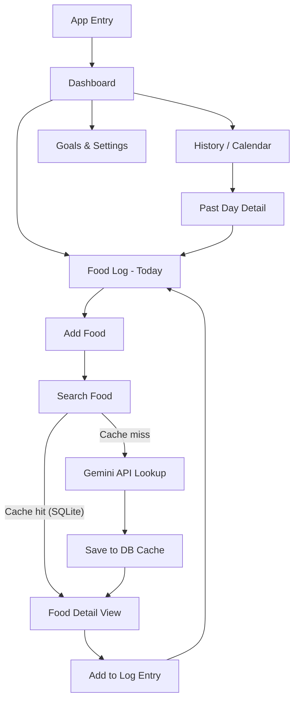

# Trackros - Macro & Nutrient Tracker App Plan

## Additional Nutrients to Track

Beyond carbs, protein, fats, sugar, and sodium, these are high-value additions:

- **Calories** (kcal) - essential baseline
- **Fiber** (g) - digestive health, affects net carbs
- **Saturated Fat** (g) - cardiovascular risk metric
- **Trans Fat** (g) - FDA-required, important for health
- **Cholesterol** (mg) - heart health
- **Potassium** (mg) - electrolyte balance, blood pressure
- **Calcium** (mg) - bone health
- **Iron** (mg) - energy, blood health
- **Vitamin C** (mg) - immunity, absorption of iron
- **Vitamin D** (mcg) - bone, immune, hormonal health
- **Magnesium** (mg) - muscle, nerve function, sleep

---

## 1. Information Architecture

### Pages & Sections



### Navigation

- **Bottom tab bar** (mobile-first): Dashboard | Log | History | Settings
- **Desktop**: Left sidebar with same 4 sections
- Persistent header showing current date + daily calorie ring

### User Flow

1. Open app → Dashboard shows today's macro rings + summary cards
2. Tap "Add Food" → search box → type food name
3. App checks SQLite cache first; if miss, calls Gemini API, saves result
4. User sees food card with all nutrients, sets portion size/serving
5. Food entry added to today's log
6. Dashboard updates in real-time
7. History page shows calendar heatmap (by calories or protein goal completion)
8. Tap any past day → see that day's full log + nutrient breakdown

---

## 2. Component Structure

### Major UI Components

```
src/
├── components/
│   ├── layout/
│   │   ├── BottomNav.tsx        # Mobile nav tabs
│   │   ├── Sidebar.tsx          # Desktop nav
│   │   └── PageHeader.tsx       # Date + quick stats
│   ├── dashboard/
│   │   ├── MacroRingChart.tsx   # Circular progress (calories, protein, carbs, fat)
│   │   ├── NutrientCard.tsx     # Reusable stat card (value / goal)
│   │   ├── DailyProgressBar.tsx # Horizontal bar per nutrient
│   │   └── MealSection.tsx      # Breakfast / Lunch / Dinner / Snacks group
│   ├── food/
│   │   ├── FoodSearchBar.tsx    # Debounced search input
│   │   ├── FoodResultCard.tsx   # Search result item
│   │   ├── FoodDetailSheet.tsx  # Bottom sheet: full nutrients + portion picker
│   │   ├── PortionSelector.tsx  # Serving size + unit input
│   │   └── NutrientTable.tsx    # Detailed nutrient breakdown table
│   ├── log/
│   │   ├── LogEntryItem.tsx     # Single food entry in the log
│   │   ├── LogSection.tsx       # Meal group with entries + add button
│   │   └── DaySummaryBar.tsx    # Sticky footer: remaining calories
│   ├── history/
│   │   ├── CalendarHeatmap.tsx  # Month view with color intensity
│   │   └── DayPreviewCard.tsx   # Tap-to-expand past day card
│   └── shared/
│       ├── CircularProgress.tsx # Reusable SVG ring
│       ├── ProgressBar.tsx      # Reusable linear bar
│       ├── Badge.tsx            # Nutrient label badges
│       ├── EmptyState.tsx       # No food logged yet
│       └── LoadingSpinner.tsx
```

### Reusable Components

- `CircularProgress` → used in MacroRingChart and NutrientCard
- `ProgressBar` → used in DailyProgressBar and NutrientTable
- `NutrientCard` → used in Dashboard, DayPreviewCard
- `FoodResultCard` → used in search results and log entries (different props)

---

## 3. Visual Direction

### Color Palette Options

**Option A - Clean Health (Recommended)**
- Background: `#F7F8FA` (off-white)
- Primary: `#22C55E` (green-500) - progress, success
- Secondary: `#3B82F6` (blue-500) - carbs ring
- Accent: `#F97316` (orange-500) - fat ring
- Purple: `#A855F7` - protein ring
- Text: `#111827` / `#6B7280`
- Card: `#FFFFFF` with subtle shadow

**Option B - Dark Vitality**
- Background: `#0F172A` (slate-900)
- Card: `#1E293B` (slate-800)
- Primary: `#34D399` (emerald-400)
- Carbs: `#60A5FA` (blue-400)
- Fat: `#FB923C` (orange-400)
- Protein: `#C084FC` (purple-400)
- Text: `#F1F5F9` / `#94A3B8`

**Option C - Warm Nourish**
- Background: `#FFFBF5` (warm cream)
- Primary: `#D97706` (amber-600)
- Secondary: `#059669` (emerald-600)
- Accent: `#DC2626` (red-600)
- Card: `#FFFFFF` with warm border `#FEF3C7`
- Text: `#1C1917` / `#78716C`

### Typography

- **Headings**: Geist (clean, modern, readable at any weight)
- **Body**: Inter (excellent screen legibility)
- **Numbers/Stats**: Geist Mono (monospaced for aligned nutrient values)

### Layout Style

**Minimalist with data density** — clean white cards, rounded corners (12-16px), soft shadows. Numbers are prominent. Color is used sparingly but meaningfully (each macro has a consistent color throughout the whole app).

---

## 4. Technical Requirements

### Data to Store

**`foods` table** (cache)
- `id`, `name`, `brand`, `serving_size`, `serving_unit`
- All 16 nutrients as columns
- `source` (gemini | manual), `created_at`

**`daily_logs` table**
- `id`, `date` (YYYY-MM-DD), `user_id`

**`log_entries` table**
- `id`, `log_id`, `food_id`, `meal_type` (breakfast/lunch/dinner/snacks)
- `servings` (float), `created_at`

**`user_goals` table**
- `calories`, `protein_g`, `carbs_g`, `fat_g`, `fiber_g`, `sodium_mg`, etc.

### API Integration

- **Gemini API (free tier)**: Used to look up nutrient data by food name
  - Prompt: structured JSON response with all 16 nutrients per 100g
  - Cache result in SQLite immediately after first fetch
  - Subsequent searches for same food skip the API
  - Rate limit handling + fallback to "nutrient data unavailable"

### Interactivity Required

- Real-time macro ring updates as food is added
- Debounced food search (300ms delay)
- Swipe to delete log entries
- Serving size slider/input that scales all nutrients proportionally
- Date picker to navigate between days
- Tap nutrient on dashboard to see breakdown across meals

### Tech Stack

- **Framework**: Next.js 15 (App Router) - full-stack, SSR + API routes in one
- **Language**: TypeScript
- **Styling**: Tailwind CSS v4 + shadcn/ui components
- **Database**: SQLite via Prisma ORM (`prisma-client` + `better-sqlite3`)
- **Gemini SDK**: `@google/generative-ai` (free tier, `gemini-1.5-flash` model)
- **Charts**: Recharts or `react-circular-progressbar` for macro rings
- **State**: Zustand (lightweight, no boilerplate)
- **Date handling**: date-fns
- **Build/Dev**: Turbopack (built into Next.js 15)

### Performance Notes

- SQLite food cache eliminates repeat Gemini calls
- Next.js Server Components for initial page loads (zero JS for static parts)
- Client components only for interactive widgets (search, rings, log entries)
- Optimistic UI updates when adding food to log

---

## Visual Sitemap

```mermaid
flowchart TD
    subgraph app [Trackros App]
        subgraph dash [Dashboard]
            D1[Daily Macro Rings]
            D2[Nutrient Summary Cards]
            D3[Meal Sections Preview]
            D4[DaySummaryBar - remaining]
        end

        subgraph log [Today's Log]
            L1[Breakfast Section]
            L2[Lunch Section]
            L3[Dinner Section]
            L4[Snacks Section]
            L5[Add Food Button per section]
        end

        subgraph search [Food Search]
            S1[Search Bar]
            S2[Recent Foods]
            S3[Search Results List]
            S4[Food Detail Sheet]
            S5[Portion Selector]
            S6[Nutrient Table]
        end

        subgraph history [History]
            H1[Calendar Heatmap]
            H2[Past Day Cards]
            H3[Past Day Detail View]
        end

        subgraph settings [Goals & Settings]
            G1[Daily Calorie Goal]
            G2[Macro Targets]
            G3[Extended Nutrient Goals]
        end
    end

    dash --> log
    log --> search
    search --> log
    dash --> history
    history --> log
    dash --> settings
```



---

## File Structure

```
trackros/
├── app/
│   ├── (dashboard)/
│   │   └── page.tsx
│   ├── log/
│   │   └── page.tsx
│   ├── history/
│   │   └── page.tsx
│   ├── settings/
│   │   └── page.tsx
│   └── api/
│       ├── food/search/route.ts     # Check cache → call Gemini
│       ├── log/route.ts             # CRUD daily log entries
│       └── goals/route.ts           # User goals
├── components/                      # (as above)
├── lib/
│   ├── db.ts                        # Prisma client singleton
│   ├── gemini.ts                    # Gemini API wrapper + prompt
│   └── nutrients.ts                 # Nutrient constants + scaling helpers
├── prisma/
│   └── schema.prisma
└── store/
    └── useLogStore.ts               # Zustand store
```
